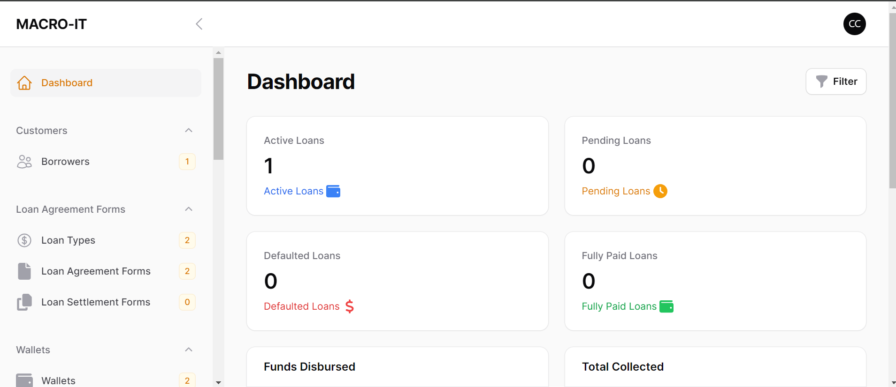
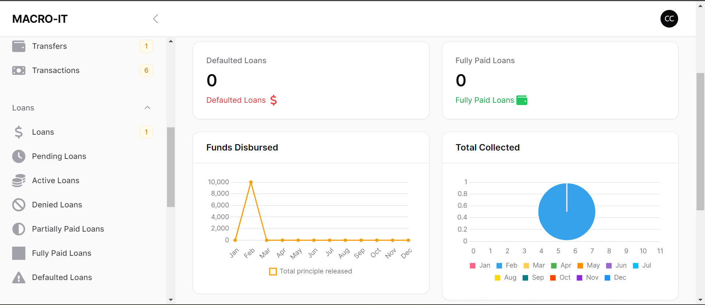
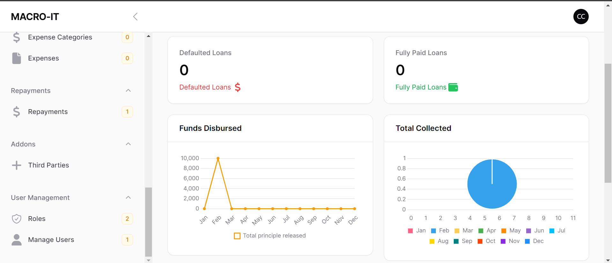
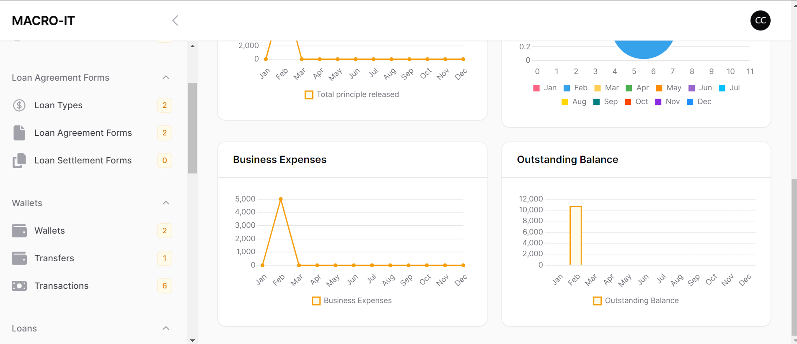

### Loan Management Software.

## Requirements

- PHP >= 8.1

[Demo!](https://github.com/chandachewe10/loan-management-system/assets/82529756/e7bd7b63-0b5e-43bc-88e1-90469e4f7111)

## How it works

The Loan Management software is a web-based application that helps manage and track loans efficiently. It provides features to streamline the loan application process, automate loan approvals, and monitor loan repayments. This README file provides an overview of the software and instructions for installation, configuration, and usage.


## Features

1. Beautiful, User-friendly interface for managing loans, borrowers, and lenders
2. Add different types of loans, their percentage and intrest cycle 
3. Add different types of wallets accounts such as expense wallet including expense categories for business expenses and loan wallet for loans payouts. 
4. Transfer funds from one wallet to the other e.g from loans wallet to the expense wallet
5. Show all transactions history  
6. Loan application form with customizable fields to collect borrowers information and add borrower files.
7. Automated loan approval process with customizable criteria and decision workflows.
8. Loan repayment tracking and reminders for borrowers.
9. Detailed loan reports and analytics for monitoring loan portfolios.
10. Role-based access control to manage user permissions.
11. Integration with external systems such as payment gateways and credit scoring services.
12. Recieve loan agreement forms via email once the loan is approved automatically and compile the loan settlement form once the loan is settled
13. View and Export Active Loans, Denied Loans, Pending Loans and Defaulted Loans
14. Update Payments for loans
15. Assign roles, assign permissions, revoke roles Etc 

## Installation

### Clone the repository
Please follow carefully the installation and use of this web framework of the Loan Management System for better utilisation of it. Do not skip any stage.

```bash
1. git clone https://github.com/chandachewe10/loan-management-system.git
2. composer install
3. copy .env.example .env and set DB Credentials
4. php artisan key:generate
5. php artisan migrate 

```
 
create a super-admin user on the terminal by running the following script and follow the prompts

```bash
php artisan shield:super-admin
```

Finally run migrations for roles and permissions by running the following scripts on your cmd and accept the prompts.
If asked for the pannel ID, enter `admin`

```bash
php artisan shield:install
```

Publish policies

```bash
php artisan shield:generate --all
```

Start Vite

```bash
npm install
npm run dev
```

Start your Application 

```bash
php artisan serve
```

```bash
Set up email notifications using [Mailtrap](https://mailtrap.io). 
Copy the mail credentials for your Laravel app from Mailtrap and update the corresponding settings in your `.env` file.
```








## Contributions
Contributions to the Loan Management software are welcome! If you have suggestions, bug reports, or feature requests, please submit an issue or a pull request on the GitHub repository.

## License
The Loan Management software is open-source and released under the MIT License.


